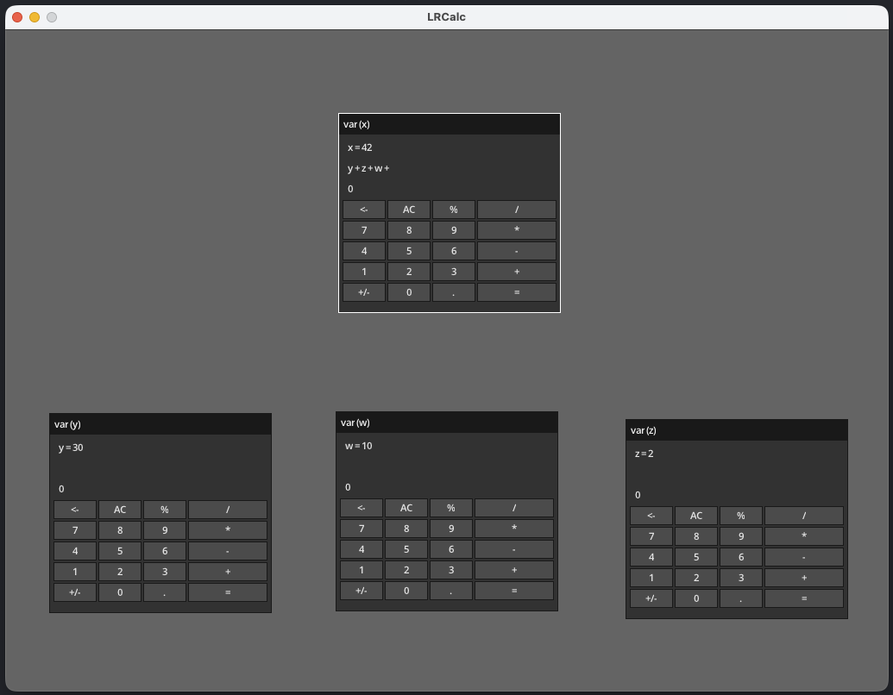

# LRCalc

### A calculator that allows you to use the results of other calculators within a calculation.

This is an entry for the [Handmade Essentials Jam 2026](https://handmade.network/jam/essentials).

Most of the time when I'm using a calculator program, I have some scratch pad on the side to jot down intermediate results. I thought it would be nice to have a program where I could just create new calculators and just references the results of that calculator output in another calculator. This was my experiment to see how a program like that may work.

LRCalc allows you to create a new calculator variable by typing in a letter on your keyboard. This will create a new calculator that you can then use to reference in any other calculator. Reference the calculator by its variable name in another calculator. The expression evaluated in one calculator is immediately updated in the other calculators.

In the screenshot below, you can see that `y`, `w`, and `z` have been evaluated to single terms which are then references by the `x` calculator variable. The result of that variable can now be used in another calculator (or you can clear that calculator and play with that formula).

